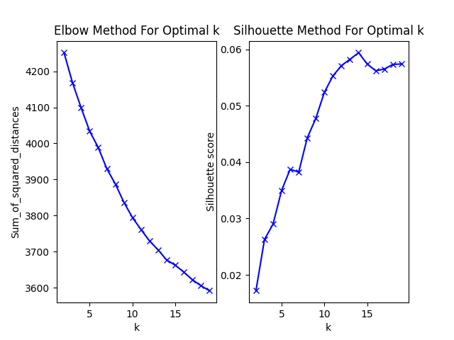
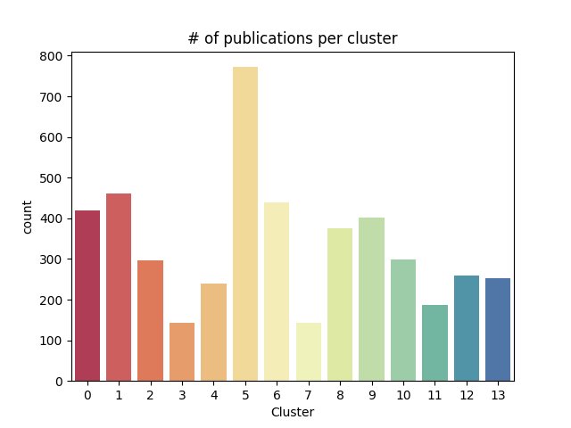
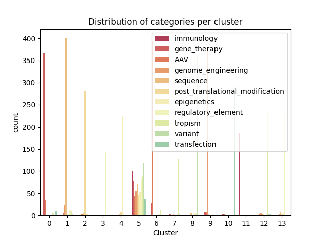
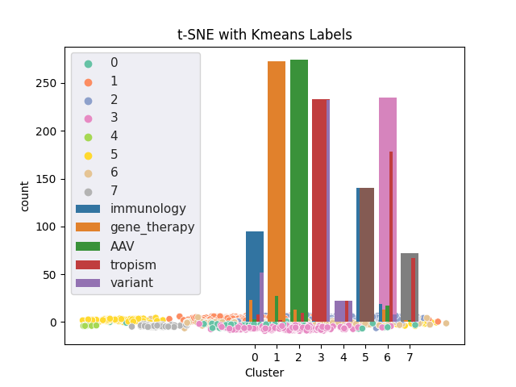

# Project - Part 1 : PDF information extraction
The aim of this project is to extract informations from PDF of research publications related to **AAV virus (adeno-associated virus)**.

Those informations are then incluted into a csv file and converted to json format in order to be transferred to a **neo4j database**.

<p align="center">
  
</p>
<p align="center">
  
</p>


# Get Started 
The use of venv is recommended for creating virtual environment with all necessary packages listed in `requirements.txt`

```
python -m venv venv/ 
source ./venv/bin/activate # OSX - bash/zsh
.\venv\Scripts\activate # Windows - Powershell
pip install -r requirements.txt
```

# Get pdf informations
Run `run pdf_infos.py` script will create:
- IDs_table.csv (reference correspondence table) - columns: DOI, PMCID, PMID, Publi_ID, Title, PDF_name.

- Publication_Metadata.csv/.json (a row for each publication) - columns: Publi_ID, Year, Authors, Title, Journal, DOI, PMID, PMCID, Keywords, Pages, Abstract, Total_word_count, AAV_count, Frequency, Linked_references, AAV_terms.

- Publication_Informations.csv/.json (a row for each AAV term found in the publications) - columns :  Publi_ID, Year, Authors, Title, Journal, DOI, PMID, PMCID, Keywords, Pages, Abstract, Total_word_count, AAV_count, Frequency, Linked_references, AAV_terms, AAV_term, AAV_term_count, Frequency_AAV_term, Linked_AAV_references.

Those files contain informations (Metadata and AAV-related informations) about the pdf files present in the ./publications folder.


# Streamlit PDF Information Extraction Application

Run ` streamlit run extraction_info_pdf.py` (pdf_infos.py corresponding application) to open the PDF information extraction tool. 
<p align="center">
  
</p>


<p align="center">
  
</p>

- Select a folder containing pdf files or select an unique pdf.
- Indicate if you want to upload existing csv files (IDs_table.csv, Publication_Metadata.csv, Publication_Informations.csv) in order to add new data to them.
- Choose to import json data to a Neo4j database by adding a configuration file (`neoj4_database.ini`, file example in src/ folder).
- Metadata (Title, Authors, DOI, PMID, PMCID, Keywords, Abstract, Journal, Year, Pdf Word Count) are retrieved using pdf manipulation packages (Fitz, pdfminer, Tika), regex patterns and pubmed API.
- AAV terms, frequency and their linked publication references are retrieved using pdf manipulation packages (Fitz, pdfminer, Tika) and regex patterns
- Retrieved informations are stored into csv files : 
  - IDs_table.csv, 
  - Publication_Metadata.csv,
  - and Publication_Informations.csv.
- Json files are generated from those csv files.
- Csv and json files are saved into the extraction_info_pdf_output/ folder
- Data are pushed to Neo4j. 


<p align="center">
  
</p>


#  Project - Part 2 : Genomic Medicine Literature Clustering Clustering 
The aim of the second part of this project is to clustering similar research article abstracts together in order to see if it's possible to simplify the search for related publications. 

the steps for doing that are the following:
1. fetch some abstracts,
1. Preprocessing of each abstract,
1. represent each abstracts as a vector,
1. perform k-means clustering,
1. perform t-SNE dimensionality reduction for visualization,
1. and perform topic modelling to find the keywords of each cluster.

## 1. Fetch publication abstracts 
Publication abstracts from different Genomic Medicine related topics were downloaded using the Pubmed Api. 
Selected query topics are:
- Adeno-Associated-Virus
- Epigenetics
- Gene Therapy
- Genome Engineering
- Immunology
- Post-Translational Modification
- Regulatory Element
- Sequence
- Transfection
- Tropism
- Variant


For each query topic a csv file was created to store the abstract and the metadata of each publications. 
Those csv files can be find in the `Abstracts/` folder.

Around 4800 abstracts were collected in total by running `Publication_clustering/scraping_abstract_pubmed.py`.

## 2. Preprocessing
- Combine all csv files into a unique dataframe,
- Remove duplicate and missing abstracts,
- remove punctuations and stopwords,
- tokenize and lemmatize,
- save as `Processed_Abstracts.csv`

The preprocessing was performed by running `Publication_clustering/data_processing.py`.

## 3. Represent each abstracts as a vector
Each abstract was transformed into a feature vector using Term Frequency–inverse Document Frequency (TF-IDF). TF-IDF evaluates how relevant a word is to a document in a collection of documents.

The clustering was based off the TF-IDF matrix  where each row is a vector representation of a publication abstract. The maximum number of features was limited to the top 512 features.

## 4. K-means clustering
The TF-IDF matrix was used as input for the k-means algorithm.

First, to determine the best k number of clusters, the silhouette score and the sum of squared distances from each point to its assigned center were computed at different k values.

<p align="center">
  
</p>

For 12 query topics, the optical k determined was **14**. 

Then, K-means was run with that number of clusters. The K-means clustering and next steps were performed by running `Publication_clustering/clustering.py`.

### Number of publications per cluster
<p align="center">
  
</p>

### Category distribution per cluster
<p align="center">
  
</p>


## 5. t-SNE dimensionality reduction
T-Distributed Stochastic Neighbor Embedding (t-SNE) reduces dimensionality while trying to keep similar instances close and dissimilar instances apart.
It is mostly used for visualization, in particular to visualize clusters of instances in high-dimensional space.

Some clusters can immediately be detected, but many others are harder to separate. In order to help to visually separate different concentrations of topics, clusters found by k-means are used as labels. 

Using t-SNE our high dimensional features vector can be reduced to 2 dimensions.
<p align="center">
  
</p>

### Top 10 words per cluster

## 6. Topic modeling


