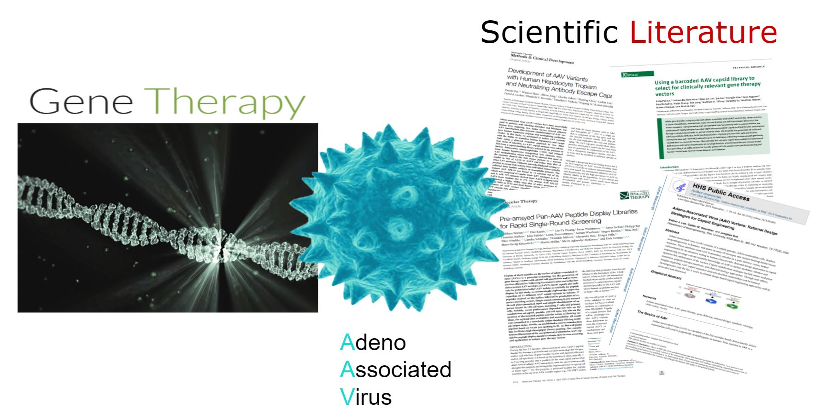
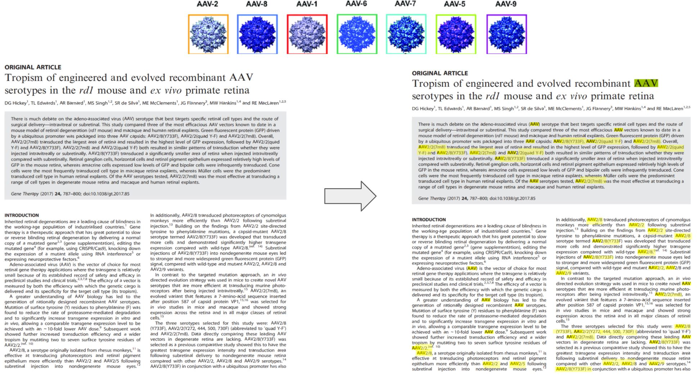
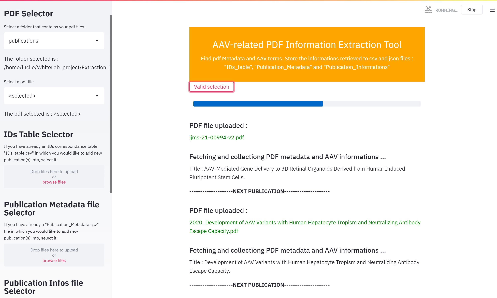
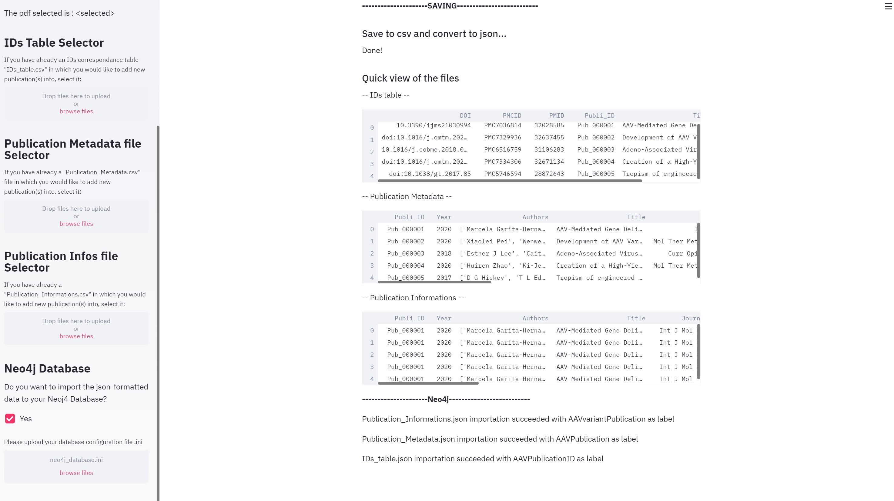
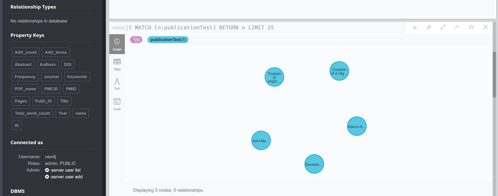

# Project 
The aim of this project is to extract informations from PDF format scientific publications related to **AAV virus (adeno-associated virus)**.

Those informations are then incluted into a csv file and converted to json format in order to be transferred to a **neo4j database**.

<p align="center">
  
</p>
<p align="center">
  
</p>


# Get Started 
The use of venv is recommended for creating virtual environment with all necessary packages listed in `requirements.txt`

```
python -m venv venv/ 
source ./venv/bin/activate # OSX - bash/zsh
.\venv\Scripts\activate # Windows - Powershell
pip install -r requirements.txt
```

# Get pdf informations
Run `run pdf_infos.py` script will create:
- IDs_table.csv (reference correspondence table) - columns: DOI, PMCID, PMID, Publi_ID, Title, PDF_name.

- Publication_Metadata.csv/.json (a row for each publication) - columns: Publi_ID, Year, Authors, Title, Journal, DOI, PMID, PMCID, Keywords, Pages, Abstract, Total_word_count, AAV_count, Frequency, Linked_references, AAV_terms.

- Publication_Informations.csv/.json (a row for each AAV term found in the publications) - columns :  Publi_ID, Year, Authors, Title, Journal, DOI, PMID, PMCID, Keywords, Pages, Abstract, Total_word_count, AAV_count, Frequency, Linked_references, AAV_terms, AAV_term, AAV_term_count, Frequency_AAV_term, Linked_AAV_references.

Those files contain informations (Metadata and AAV-related informations) about the pdf files present in the ./publications folder.


# Streamlit PDF Information Extraction Application

Run ` streamlit run extraction_info_pdf.py` (pdf_infos.py corresponding application) to open the PDF information extraction tool. 
<p align="center">
  
</p>


<p align="center">
  
</p>

- Select a folder containing pdf files or select an unique pdf.
- Indicate if you want to upload existing csv files (IDs_table.csv, Publication_Metadata.csv, Publication_Informations.csv) in order to add new data to them.
- Choose to import json data to a Neo4j database by adding a configuration file (`neoj4_database.ini`).
- Metadata (Title, Authors, DOI, PMID, PMCID, Keywords, Abstract, Journal, Year, Pdf Word Count) are retrieved using pdf manipulation packages (Fitz, pdfminer, Tika), regex patterns and pubmed API.
- AAV terms, frequency and their linked publication references are retrieved using pdf manipulation packages (Fitz, pdfminer, Tika) and regex patterns
- Retrieved informations are stored into csv files : 
  - IDs_table.csv, 
  - Publication_Metadata.csv,
  - and Publication_Informations.csv.
- Json files are generated from those csv files.
- Csv and json files are saved into the extraction_info_pdf_output/ folder
- Data are pushed to Neo4j. 


<p align="center">
  
</p>


# Script description :
